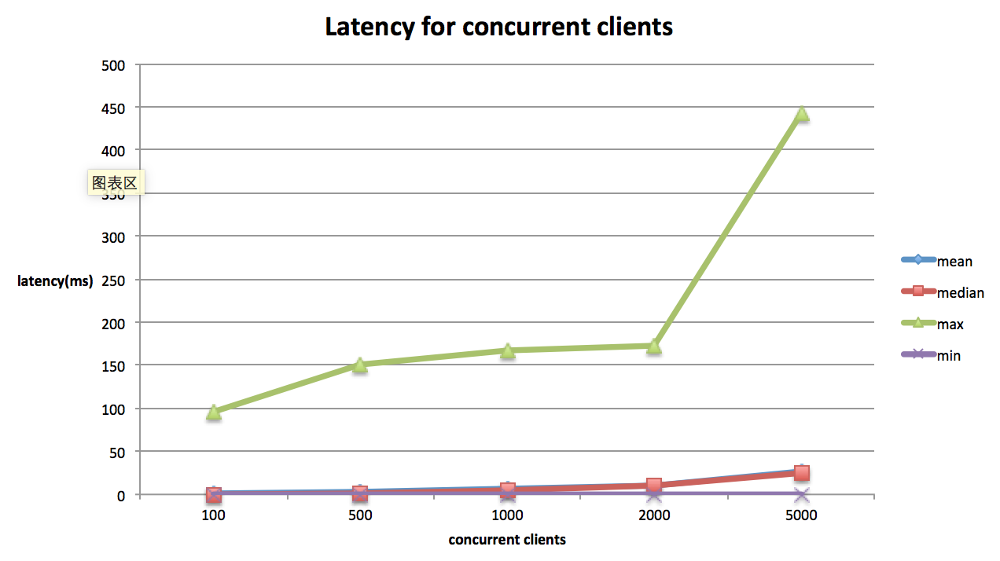

# rpcx

[](https://opensource.org/licenses/Apache-2.0) [](http://godoc.org/github.com/smallnest/rpcx) [](https://drone.io/github.com/smallnest/rpcx/latest)  [](https://goreportcard.com/report/github.com/smallnest/rpcx)


rpcx是一个类似阿里巴巴 [Dubbo](http://dubbo.io/) 和微博 [Motan](https://github.com/weibocom/motan) 的分布式的RPC服务框架，基于Golang net/rpc实现。 





与gRPC比较，完胜gRPC, 更不用说其它的"老"的RPC框架了。


谈起分布式的RPC框架，比较出名的是阿里巴巴的dubbo,包括由当当网维护的dubbox。
不知道dubbo在阿里的内部竞争中败给了HSF，还是阿里有意将其闭源了，官方的代码使用的spring还停留在2.5.6.SEC03的版本，dubbox的spring也只升级到3.2.9.RELEASE。
不管怎样，dubbo还是在电商企业得到广泛的应用，京东也有部分在使用dubbo开发。

> DUBBO是一个分布式服务框架，致力于提供高性能和透明化的RPC远程服务调用方案，是阿里巴巴SOA服务化治理方案的核心框架，每天为2,000+个服务提供3,000,000,000+次访问量支持，并被广泛应用于阿里巴巴集团的各成员站点。
微博的RPC框架 Motan 也正式开源了，如张雷所说：

> 2013 年微博 RPC 框架 Motan 在前辈大师们（福林、fishermen、小麦、王喆等）的精心设计和辛勤工作中诞生，向各位大师们致敬，也得到了微博各个技术团队的鼎力支持及不断完善，如今 Motan 在微博平台中已经广泛应用，每天为数百个服务完成近千亿次的调用。

这两个优秀的框架都是使用Java开发的，国外的互联网企业也有非常出名的的RPC框架如[thrift](https://thrift.apache.org/)、[finagle](https://github.com/twitter/finagle)。

本项目[rpcx](https://github.com/smallnest/rpcx)的目标就是实现一个Go生态圈的Dubbo，为Go生态圈提供一个分布式的、多插件的、带有服务治理功能的产品级的RPC框架。

Go生态圈已经有一些RPC库，如官方的[net/rpc](https://golang.org/pkg/net/rpc/)、[grpc-go](https://github.com/grpc/grpc-go)、[gorilla-rpc](http://www.gorillatoolkit.org/pkg/rpc)等，为什么还要开发**rpcx**呢？

原因在于尽管这些框架都是为Go实现的RPC库，但是它们的功能比较单一，只是实现了点对点(End-to-End)的通讯框架。缺乏服务治理的功能，比如服务注册和发现、
负载均衡、容灾、服务监控等功能。因此我基于Go net/rpc框架实现了一个类似Dubbo的分布式框架。

和rpcx比较类似的Go RPC框架是[go-micro](https://github.com/micro/go-micro)，但是rpcx提供了更丰富的功能，基于TCP的通讯协议性能更好。

## RPC是什么
远程过程调用（英语：Remote Procedure Call，缩写为 RPC）是一个计算机通信协议。该协议允许运行于一台计算机的程序调用另一台计算机的子程序，而程序员无需额外地为这个交互作用编程。如果涉及的软件采用面向对象编程，那么远程过程调用亦可称作远程调用或远程方法调用，例：Java RMI。
简单地说就是能使应用像调用本地方法一样的调用远程的过程或服务。很显然，这是一种client-server的交互形式，调用者(caller)是client,执行者(executor)是server。典型的实现方式就是request–response通讯机制。

RPC 是进程之间的通讯方式(inter-process communication, IPC), 不同的进程有不同的地址空间。
如果client和server在同一台机器上，尽管物理地址空间是相同的，但是虚拟地址空间不同。
如果它们在不同的主机上，物理地址空间也不同。

RPC的实现的技术各不相同，也不一定兼容。

一个正常的RPC过程可以分成下面几步：
1. client调用client stub，这是一次本地过程调用
2. client stub将参数打包成一个消息，然后发送这个消息。打包过程也叫做 marshalling
3. client所在的系统将消息发送给server
4. server的的系统将收到的包传给server stub
5. server stub解包得到参数。 解包也被称作 unmarshalling
6. 最后server stub调用服务过程. 返回结果按照相反的步骤传给client


RPC只是描绘了 Client 与 Server 之间的点对点调用流程，包括 stub、通信、RPC 消息解析等部分，在实际应用中，还需要考虑服务的高可用、负载均衡等问题，所以产品级的 RPC 框架除了点对点的 RPC 协议的具体实现外，还应包括服务的发现与注销、提供服务的多台 Server 的负载均衡、服务的高可用等更多的功能。
目前的 RPC 框架大致有两种不同的侧重方向，一种偏重于服务治理，另一种偏重于跨语言调用。

服务治理型的 RPC 框架有 Dubbo、DubboX、Motan 等，这类的 RPC 框架的特点是功能丰富，提供高性能的远程调用以及服务发现及治理功能，适用于大型服务的微服务化拆分以及管理，对于特定语言（Java）的项目可以十分友好的透明化接入。但缺点是语言耦合度较高，跨语言支持难度较大。

跨语言调用型的 RPC 框架有 Thrift、gRPC、Hessian、Hprose 等，这一类的 RPC 框架重点关注于服务的跨语言调用，能够支持大部分的语言进行语言无关的调用，非常适合于为不同语言提供通用远程服务的场景。但这类框架没有服务发现相关机制，实际使用时一般需要代理层进行请求转发和负载均衡策略控制。

本项目 rpcx 属于服务治理类型，是一个基于 Go 开发的高性能的轻量级 RPC 框架，Motan 提供了实用的服务治理功能和基于插件的扩展能力。

## RPCX的特点

rpcx使用Go实现，适合使用Go语言实现RPC的功能。

* 基于net/rpc,可以将net/rpc实现的RPC项目轻松的转换为分布式的RPC
* 插件式设计，可以配置所需的插件，比如服务发现、日志、统计分析等
* 基于TCP长连接,只需很小的额外的消息头
* 支持多种编解码协议，如Gob、Json、MessagePack、gencode、ProtoBuf等
* 服务发现：服务发布、订阅、通知等，支持多种发现方式如ZooKeeper、Etcd等
* 高可用策略：失败重试（Failover）、快速失败（Failfast）
* 负载均衡：支持随机请求、轮询、低并发优先、一致性 Hash等
* 规模可扩展，可以根据性能的需求增减服务器
* 其他：调用统计、访问日志等

rpcx目标是轻量级的，小而简单，但是期望所有的功能都可以通过插件的方式搭积木的方式完成。

## RPCX架构
rpcx中有服务提供者 RPC Server，服务调用者 RPC Client 和服务注册中心 Registry 三个角色。
* Server 向 Registry 注册服务，并向注册中心发送心跳汇报状态(基于不同的registry有不同的实现)。
* Client 需要向注册中心查询 RPC 服务者列表，Client 根据 Registry 返回的服务者列表，选取其中一个 Sever 进行 RPC 调用。
* 当 Server 发生宕机时，Registry 会监测到服务者不可用(zookeeper session机制或者手工心跳)，Client 感知后会对本地的服务列表作相应调整。client可能被动感知(zookeeper)或者主动定时拉取。
* 可选地，Server可以定期向Registry汇报调用统计信息，Client可以根据调用次数选择压力最小的Server


当前rpcx支持zookeeper, etcd等注册中心，Consul注册中心正在开发中。

rpcx基于Go net/rpc的底层实现， Client和Server之间通讯是通过TCP进行通讯的，它们之间通过Client发送Request，Server返回Response实现。
Request和Response消息的格式都是`Header+Body`的格式。Header和Body具体的格式根据编码方式的不同而不同，可以是二进制，也可以是结构化数据如JSON。


## RPCX的特性
rpcx拥有众多特性。

### 服务器特性

#### 编码 (序列化)
rpcx当前支持多种序列化/反序列化的方式，可以根据需求选择合适的编码库。

| 特性 | 功能描述  | 
| --- | --- |
| [gob](https://golang.org/pkg/encoding/gob/) |官方提供的序列化方式，基于一个包含元数据的流 |
| [jsonrpc](https://golang.org/pkg/net/rpc/jsonrpc/)|也是官方提供的编码库，以JSON格式传输 |
|[msgp](http://msgpack.org/)|类似json格式的编码，但是更小更快，可以直接编码struct |
|[gencode](https://github.com/andyleap/gencode)|一个超级快的序列化库，需要定义schema,但是定义方式和struct类似 |
|[protobuf](https://github.com/google/protobuf)|Google推出的广受关注的序列化库，推荐使用[gogo-protobuf](https://github.com/gogo/protobuf)，可以获得更高的性能|

在数据结构简单的情况下，这几种库都可以满足需求，参照本文中的benchmark测试。但是如果追求性能，建议采用后面三种序列化库。

序列化库的选择对于RPC服务的影响是巨大的，我创建了另外一个项目专门比较各序列化库的性能： [gosercomp](https://github.com/smallnest/gosercomp)。

新的序列化库的实现也非常简单，只需实现下面两个方法即可：
```go 
func NewXXXXXServerCodec(conn io.ReadWriteCloser) rpc.ServerCodec {
    ……
}
func NewXXXXXClientCodec(conn io.ReadWriteCloser) rpc.ClientCodec {
    ……
}
```

编码库负责marshal/unmarshal Reuqest/Response， 包括消息中的Header和Body。
如果你想，你也可以对Header和Body实现不同的编码。

#### 注册中心 
目前提供了两种注册中心:

* ZooKeeperRegisterPlugin
通过ZooKeeper实现服务发现。
服务在注册的时候会自动在ZooKeeper上创建一个Ephemeral节点，因此当服务宕机的时候此节点就被删除，Client也会感知到。
同时，Server也会把调用次数定时更新到ZooKeeper，这样Client可以根据一段时间的调用次数选择压力较小的服务器节点进行连接。


注册中心的配置只需在服务器初始化的时候增加以下代码，服务的实现无需做任何的改动，也不需要额外的配置。
```go 
	plugin := &ZooKeeperRegisterPlugin{
		ServiceAddress:   "tcp@127.0.0.1:1234",
		ZooKeeperServers: []string{"127.0.0.1:2181"},
		BasePath:         "/rpcx",
		metrics:          metrics.NewRegistry(),
		Services:         make([]string, 1),
		updateInterval:   time.Minute,
	}
    server.PluginContainer.Add(plugin)
```

其中ServiceAddress为本机(Server)要暴露给Client地址。因为ZooKeeper的节点名不支持"/"，
所以此处用"@"代替"://"。

ZooKeeperServers为ZK集群的地址。

BasePath为一个服务组，此组下的服务对于Client都是可见的。


* EtcdRegisterPlugin
通过etcd也可以实现服务发现。

etcd可以通过TTL判断服务器的存活，另外此插件也会定时把调用次数定时更新到etcd。

此插件可以使用下面的代码配置：
```go 
	plugin := &EtcdRegisterPlugin{
		ServiceAddress: "tcp@127.0.0.1:1234",
		EtcdServers:    []string{"http://127.0.0.1:2379"},
		BasePath:       "/rpcx",
		metrics:        metrics.NewRegistry(),
		Services:       make([]string, 1),
		updateInterval: time.Minute,
	}
    server.PluginContainer.Add(plugin)
```


注意注册中心插件必须在配置服务之前设置，否则注册中心无法获取要注册的服务信息。


#### 扩展点
当前rpcx为server提供了以下扩展点：

* 服务注册时
* Client连接时
* 读取Request Header的前后
* 读取Request Body的前后
* 返回Response的前后

你可以根据这些扩展点编写自己的插件，只需实现相应的接口即可。
定义的接口你可以看godoc的IXXXXXXPlugin的定义。

上面介绍的注册中心就是通过插件的方式实现。同时rpcx还实现了其它的插件，如下面的介绍。

* LogRegisterPlugin: 记录服务注册日志
* MetricsPlugin: 统计服务调用次数和处理时间
* RateLimitingPlugin: 限流操作，限定服务器的TPS

### 客户端特性

#### 负载均衡
负载均衡是通过不同的ClientSelector来实现的。


| 负载均衡器 | 功能描述  | 
| --- | --- |
|DirectClientSelector|点对点的直连，客户端直接连接一个服务器|
|MultiClientSelector|多对多的直连，一个客户端可以从一组固定的服务器中选择一个直连，无需注册中心|
|ZooKeeperClientSelector|从ZK注册中心选择一个服务器连接|
|EtcdClientSelector|从Etcd注册中心选择一个服务器连接|

一个Selector需要实现ClientSelector接口：
```go 
type ClientSelector interface {
	Select(clientCodecFunc ClientCodecFunc) (*rpc.Client, error)
}
```

Client的序列化方式必须和服务器的序列化方式保持一致。

#### 容错
Client提供了两种容错方式: `Failfast`、`Failover`、`Failtry`:
* Failfast: 如果Client调用失败，立即返回，不会重试
* Failover: 如果Client调用失败，会尝试从服务列表中选择另外一个服务器调用，直到成功或者到达重试次数
* Failtry： 如果Client调用失败，会继续这个服务器重试，直到成功或者到达重试次数

#### 重选算法
对于多个服务器，重选发送支持：
* 随机选择： 随机选择一个服务器并返回，可能和上一次的重复
* RoundRobin: 按顺序选择一个服务器
* 一致性哈希 [TODO]:使用[Jump Consistent Hash algorithm](https://arxiv.org/ftp/arxiv/papers/1406/1406.2294.pdf)
* CallLeast [TODO]: 根据调用次数选择压力最小的服务器

#### 扩展点
Client的扩展点如下：
* 读取Response Header的前后
* 读取Response Body的前后
* 写Request的前后


#### 身份授权
rpcx提供了身份授权的功能。服务提供者可以提供身份验证的功能，只有授权的客户端才允许调用服务。

服务授权的具体实现有服务提供者实现。可以实现OAuth2、数据库验证、Session或者授权码等任意的方式。
比如OAuth2方式，客户端可以先在OAuth2进行身份验证，获得一个access token,比如"Bearer 0b79bab50daca910b000d4f1a2b675d604257e42",
然后将这个acccess token加入到请求中即可。 服务端得到这个access token，可以进行身份验证，检查是否是授权的access token,
如果不是授权的access token,则拒绝服务。

同理，客户端可以采用用户名+密码的方式进行验证，将用户名和密码发送给服务器。<br/>
客户端也可以使用应用码的方式，让服务器预先分配好一个应用码，以后客户端只要将这个应用码发给服务器即可。

服务器的例子:
```go
func main() {
	server := rpcx.NewServer()

	fn := func(p *plugin.AuthorizationAndServiceMethod) error {
		if p.Authorization != "0b79bab50daca910b000d4f1a2b675d604257e42" || p.Tag != "Bearer" {
			fmt.Printf("error: wrong Authorization: %s, %s\n", p.Authorization, p.Tag)
			return errors.New("Authorization failed ")
		}

		fmt.Println("Authorization success")
		return nil
	}

	server.Auth(fn)

	server.RegisterName("Arith", new(Arith))
	server.Serve("tcp", "127.0.0.1:8972")
}
```

客户端的例子：
```go
func main() {
	s := &rpcx.DirectClientSelector{Network: "tcp", Address: "127.0.0.1:8972", Timeout: 10 * time.Second}
	client := rpcx.NewClient(s)

	//add Authorization info
	err := client.Auth("0b79bab50daca910b000d4f1a2b675d604257e42_ABC", "Bearer")
	if err != nil {
		fmt.Printf("can't add auth plugin: %#v\n", err)
	}

	args := &Args{7, 8}
	var reply Reply
	err = client.Call("Arith.Mul", args, &reply)
	if err != nil {
		fmt.Printf("error for Arith: %d*%d, %v \n", args.A, args.B, err)
	} else {
		fmt.Printf("Arith: %d*%d=%d \n", args.A, args.B, reply.C)
	}

	client.Close()
}
```

## RPCX例子

### 点对点 
点对点的实现和Go net/rpc的使用基本一致。

#### Server 
```go 
package main

import "github.com/smallnest/rpcx"

type Args struct {
	A int `msg:"a"`
	B int `msg:"b"`
}

type Reply struct {
	C int `msg:"c"`
}

type Arith int

func (t *Arith) Mul(args *Args, reply *Reply) error {
	reply.C = args.A * args.B
	return nil
}

func (t *Arith) Error(args *Args, reply *Reply) error {
	panic("ERROR")
}

func main() {
	server := rpcx.NewServer()
	server.RegisterName("Arith", new(Arith))
	server.Serve("tcp", "127.0.0.1:8972")
}
```

#### Client
同步方式：
```go 
package main

import (
	"fmt"
	"time"

	"github.com/smallnest/rpcx"
)

type Args struct {
	A int `msg:"a"`
	B int `msg:"b"`
}

type Reply struct {
	C int `msg:"c"`
}

func main() {
	s := &rpcx.DirectClientSelector{Network: "tcp", Address: "127.0.0.1:8972", Timeout: 10 * time.Second}
	client := rpcx.NewClient(s)

	args := &Args{7, 8}
	var reply Reply
	err := client.Call("Arith.Mul", args, &reply)
	if err != nil {
		fmt.Printf("error for Arith: %d*%d, %v \n", args.A, args.B, err)
	} else {
		fmt.Printf("Arith: %d*%d=%d \n", args.A, args.B, reply.C)
	}

	client.Close()
}
```

异步方式(通过Channel获得执行结果):
```go 
package main

import (
	"fmt"
	"time"

	"github.com/smallnest/rpcx"
)

type Args struct {
	A int `msg:"a"`
	B int `msg:"b"`
}

type Reply struct {
	C int `msg:"c"`
}

func main() {
	s := &rpcx.DirectClientSelector{Network: "tcp", Address: "127.0.0.1:8972", Timeout: 10 * time.Second}
	client := rpcx.NewClient(s)

	args := &Args{7, 8}
	var reply Reply
	divCall := client.Go("Arith.Mul", args, &reply, nil)
	replyCall := <-divCall.Done // will be equal to divCall
	if replyCall.Error != nil {
		fmt.Printf("error for Arith: %d*%d, %v \n", args.A, args.B, replyCall.Error)
	} else {
		fmt.Printf("Arith: %d*%d=%d \n", args.A, args.B, reply.C)
	}

	client.Close()
}
```

### 多服务器
#### Server 
这里例子启动了两个服务器，其中一个服务器故意将 `7 * 8`计算成 `560`，以便和另外一个服务器进行区分，我们可以观察计算结果。

```go 
package main

import "github.com/smallnest/rpcx"

type Args struct {
	A int `msg:"a"`
	B int `msg:"b"`
}

type Reply struct {
	C int `msg:"c"`
}

type Arith int

func (t *Arith) Mul(args *Args, reply *Reply) error {
	reply.C = args.A * args.B
	return nil
}

func (t *Arith) Error(args *Args, reply *Reply) error {
	panic("ERROR")
}

type Arith2 int

func (t *Arith2) Mul(args *Args, reply *Reply) error {
	reply.C = args.A * args.B * 10
	return nil
}

func (t *Arith2) Error(args *Args, reply *Reply) error {
	panic("ERROR")
}

func main() {
	server1 := rpcx.NewServer()
	server1.RegisterName("Arith", new(Arith))
	server1.Start("tcp", "127.0.0.1:8972")

	server2 := rpcx.NewServer()
	server2.RegisterName("Arith", new(Arith2))
	server2.Serve("tcp", "127.0.0.1:8973")
}
```

#### Client

**随机选取服务器的例子**:
```go 
package main

import (
	"fmt"
	"time"

	"github.com/smallnest/rpcx"
	"github.com/smallnest/rpcx/clientselector"
)

type Args struct {
	A int `msg:"a"`
	B int `msg:"b"`
}

type Reply struct {
	C int `msg:"c"`
}

func main() {
	server1 := clientselector.ServerPair{Network: "tcp", Address: "127.0.0.1:8972"}
	server2 := clientselector.ServerPair{Network: "tcp", Address: "127.0.0.1:8973"}

	servers := []clientselector.ServerPair{server1, server2}

	s := clientselector.NewMultiClientSelector(servers, rpcx.RandomSelect, 10*time.Second)

	for i := 0; i < 10; i++ {
		callServer(s)
	}
}

func callServer(s rpcx.ClientSelector) {
	client := rpcx.NewClient(s)

	args := &Args{7, 8}
	var reply Reply
	err := client.Call("Arith.Mul", args, &reply)
	if err != nil {
		fmt.Printf("error for Arith: %d*%d, %v \n", args.A, args.B, err)
	} else {
		fmt.Printf("Arith: %d*%d=%d \n", args.A, args.B, reply.C)
	}

	client.Close()
}
```

**RoundRobin选取服务器的例子**
```go 
package main

import (
	"fmt"
	"time"

	"github.com/smallnest/rpcx"
	"github.com/smallnest/rpcx/clientselector"
)

type Args struct {
	A int `msg:"a"`
	B int `msg:"b"`
}

type Reply struct {
	C int `msg:"c"`
}

func main() {
	server1 := clientselector.ServerPair{Network: "tcp", Address: "127.0.0.1:8972"}
	server2 := clientselector.ServerPair{Network: "tcp", Address: "127.0.0.1:8973"}

	servers := []clientselector.ServerPair{server1, server2}

	s := clientselector.NewMultiClientSelector(servers, rpcx.RoundRobin, 10*time.Second)

	for i := 0; i < 10; i++ {
		callServer(s)
	}
}

func callServer(s rpcx.ClientSelector) {
	client := rpcx.NewClient(s)
	args := &Args{7, 8}
	var reply Reply
	err := client.Call("Arith.Mul", args, &reply)
	if err != nil {
		fmt.Printf("error for Arith: %d*%d, %v \n", args.A, args.B, err)
	} else {
		fmt.Printf("Arith: %d*%d=%d \n", args.A, args.B, reply.C)
	}

	client.Close()
}
```

**Failover**
```go 
package main

import (
	"fmt"
	"time"

	"github.com/smallnest/rpcx"
	"github.com/smallnest/rpcx/clientselector"
)

type Args struct {
	A int `msg:"a"`
	B int `msg:"b"`
}

type Reply struct {
	C int `msg:"c"`
}

func main() {
	server1 := clientselector.ServerPair{Network: "tcp", Address: "127.0.0.1:8972"}
	server2 := clientselector.ServerPair{Network: "tcp", Address: "127.0.0.1:8973"}
	server3 := clientselector.ServerPair{Network: "tcp", Address: "127.0.0.1:8974"}

	servers := []clientselector.ServerPair{server1, server2, server3}

	s := clientselector.NewMultiClientSelector(servers, rpcx.RoundRobin, 10*time.Second)

	for i := 0; i < 10; i++ {
		callServer(s)
	}
}

func callServer(s rpcx.ClientSelector) {
	client := rpcx.NewClient(s)
	client.FailMode = rpcx.Failover
	args := &Args{7, 8}
	var reply Reply
	err := client.Call("Arith.Mul", args, &reply)
	if err != nil {
		fmt.Printf("error for Arith: %d*%d, %v \n", args.A, args.B, err)
	} else {
		fmt.Printf("Arith: %d*%d=%d \n", args.A, args.B, reply.C)
	}

	client.Close()
}
```

## Benchmark

**测试环境**
* CPU:    Intel(R) Xeon(R) CPU E5-2620 v2 @ 2.10GHz, 24 cores
* Memory: 16G
* OS:     Linux Server-3 2.6.32-358.el6.x86_64, CentOS 6.4
* Go:     1.7

测试代码client是通过protobuf编解码和server通讯的。
请求发送给server, server解码、更新两个字段、编码再发送给client，所以整个测试会包含客户端的编解码和服务器端的编解码。
消息的内容大约为581 byte, 在传输的过程中会增加少许的头信息，所以完整的消息大小在600字节左右。

测试用的proto文件如下：

```proto
syntax = "proto2";

package main;

option optimize_for = SPEED;


message BenchmarkMessage {
  required string field1 = 1;
  optional string field9 = 9;
  optional string field18 = 18;
  optional bool field80 = 80 [default=false];
  optional bool field81 = 81 [default=true];
  required int32 field2 = 2;
  required int32 field3 = 3;
  optional int32 field280 = 280;
  optional int32 field6 = 6 [default=0];
  optional int64 field22 = 22;
  optional string field4 = 4;
  repeated fixed64 field5 = 5;
  optional bool field59 = 59 [default=false];
  optional string field7 = 7;
  optional int32 field16 = 16;
  optional int32 field130 = 130 [default=0];
  optional bool field12 = 12 [default=true];
  optional bool field17 = 17 [default=true];
  optional bool field13 = 13 [default=true];
  optional bool field14 = 14 [default=true];
  optional int32 field104 = 104 [default=0];
  optional int32 field100 = 100 [default=0];
  optional int32 field101 = 101 [default=0];
  optional string field102 = 102;
  optional string field103 = 103;
  optional int32 field29 = 29 [default=0];
  optional bool field30 = 30 [default=false];
  optional int32 field60 = 60 [default=-1];
  optional int32 field271 = 271 [default=-1];
  optional int32 field272 = 272 [default=-1];
  optional int32 field150 = 150;
  optional int32 field23 = 23 [default=0];
  optional bool field24 = 24 [default=false];
  optional int32 field25 = 25 [default=0];
  optional bool field78 = 78;
  optional int32 field67 = 67 [default=0];
  optional int32 field68 = 68;
  optional int32 field128 = 128 [default=0];
  optional string field129 = 129 [default="xxxxxxxxxxxxxxxxxxxxx"];
  optional int32 field131 = 131 [default=0];
}
```


测试的并发client是 100, 1000,2000 and 5000。总请求数一百万。

**测试结果**

### 一个服务器和一个客户端，在同一台机器上

并发client|平均值(ms)|中位数(ms)|最大值(ms)|最小值(ms)|吞吐率(TPS)
-------------|-------------|-------------|-------------|-------------|-------------
100|0|0|17|0|164338
500|2|1|40|0|181126
1000|4|3|56|0|186219
2000|9|7|105|0|182815
5000|25|22|200|0|178858


可以看出平均值和中位数值相差不大，说明没有太多的离谱的延迟。

随着并发数的增大，服务器延迟也越长，这是正常的。

### 客户端在一台机器上，服务器在另外一台机器上

如果我们把客户端和服务器端的程序放在两台独立机器上，这两台机器的配置和上面的测试相同。测试结果如下：

并发client|平均值(ms)|中位数(ms)|最大值(ms)|最小值(ms)|吞吐率(TPS)
-------------|-------------|-------------|-------------|-------------|-------------
100|1|1|20|0|127975
500|5|1|4350|0|136407
1000|10|2|3233|0|155255
2000|17|2|9735|0|159438
5000|44|2|12788|0|161917 

因为与实际的网络传输，所以吞吐量没有上面的使用loopback的结果好，但是吞吐量已经不错了，接近每秒10万个事务处理。


### 客户端在一台机器上，两个服务器在另外两台机器上

如果部署成集群的模式，一个客户端，两个服务器端，测试结果如下：

并发client|平均值(ms)|中位数(ms)|最大值(ms)|最小值(ms)|吞吐率(TPS)
-------------|-------------|-------------|-------------|-------------|-------------
100|0|0|41|0|128932
500|3|2|273|0|150285
1000|5|5|621|0|150152
2000|10|7|288|0|159974
5000|23|12|629|0|155279


### 以下的代码是测试rpcx使用的序列化框架的性能。
```
[root@localhost rpcx]# go test -bench . -test.benchmem
PASS
BenchmarkNetRPC_gob-16            100000             18742 ns/op             321 B/op          9 allocs/op
BenchmarkNetRPC_jsonrpc-16        100000             21360 ns/op            1170 B/op         31 allocs/op
BenchmarkNetRPC_msgp-16           100000             18617 ns/op             776 B/op         35 allocs/op
BenchmarkRPCX_gob-16              100000             18718 ns/op             320 B/op          9 allocs/op
BenchmarkRPCX_json-16             100000             21238 ns/op            1170 B/op         31 allocs/op
BenchmarkRPCX_msgp-16             100000             18635 ns/op             776 B/op         35 allocs/op
BenchmarkRPCX_gencodec-16         100000             18454 ns/op            4485 B/op         17 allocs/op
BenchmarkRPCX_protobuf-16         100000             17234 ns/op             733 B/op         13 allocs/op
```


## 和gRPC比较
[gRPC](https://github.com/grpc/grpc-go) 是Google开发的一个RPC框架，支持多种编程语言。

我对gRPC和rpcx进行了相同的测试，得到了相应的测试结果。结果显示rpcx的性能要远远好于gRPC。
gRPC的优势之一就是随着并发数的增大，吞吐率比较稳定，而rpcx随着并发数的增加性能有所下降，但总体吞吐率还是要高于gRPC的。

rpcx的测试结果如上，下面事gRPC的测试结果。

### 一个服务器和一个客户端，在同一台机器上

并发client|平均值(ms)|中位数(ms)|最大值(ms)|最小值(ms)|吞吐率(TPS)
-------------|-------------|-------------|-------------|-------------|-------------
100|0|0|20|0|55561
500|7|6|59|0|62593
1000|14|12|103|0|65329
2000|28|24|163|0|67033
5000|71|64|380|0|63803


### 客户端在一台机器上，服务器在另外一台机器上

并发client|平均值(ms)|中位数(ms)|最大值(ms)|最小值(ms)|吞吐率(TPS)
-------------|-------------|-------------|-------------|-------------|-------------
100|1|0|21|0|68250
500|5|1|3059|0|78486
1000|10|1|6274|0|79980
2000|19|1|9736|0|58129
5000|43|2|14224|0|44724


### 客户端在一台机器上，两个服务器在另外两台机器上

并发client|平均值(ms)|中位数(ms)|最大值(ms)|最小值(ms)|吞吐率(TPS)
-------------|-------------|-------------|-------------|-------------|-------------
100|1|0|19|0|88082
500|4|1|1461|0|90334
1000|9|1|6315|0|62305
2000|17|1|9736|0|44487
5000|38|1|25087|0|33198


## 参考文档
1. [谁能用通俗的语言解释一下什么是RPC框架？](https://www.zhihu.com/question/25536695)
2. [DUBBO](http://dubbo.io/)
3. [支撑微博千亿调用的轻量级RPC框架：Motan](http://weibo.com/ttarticle/p/show?id=2309403951077522312320)
4. [你应该知道的 RPC 原理](http://blog.jobbole.com/92290/)
5. [Twitter的RPC框架Finagle简介](http://www.infoq.com/cn/news/2014/05/twitter-finagle-intro)
6. [armeria: Netty的作者正在开发的一个RPC库](https://github.com/line/armeria)
7. [wikipedia RPC](https://en.wikipedia.org/wiki/Remote_procedure_call)
