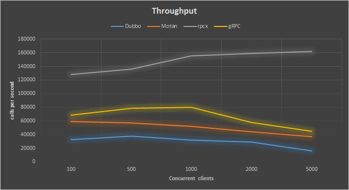
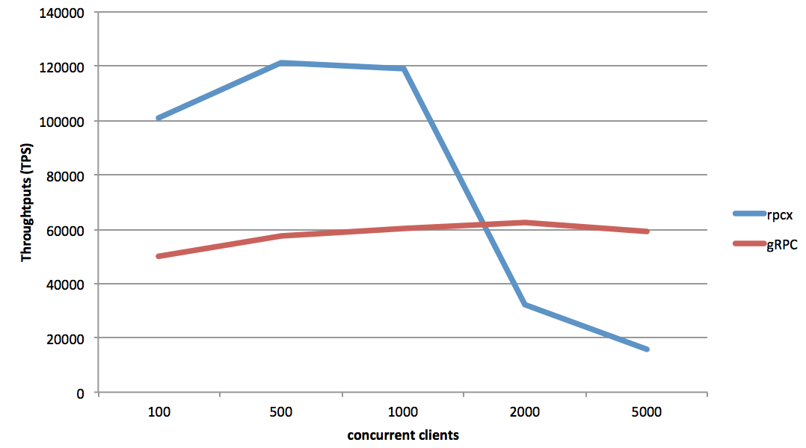
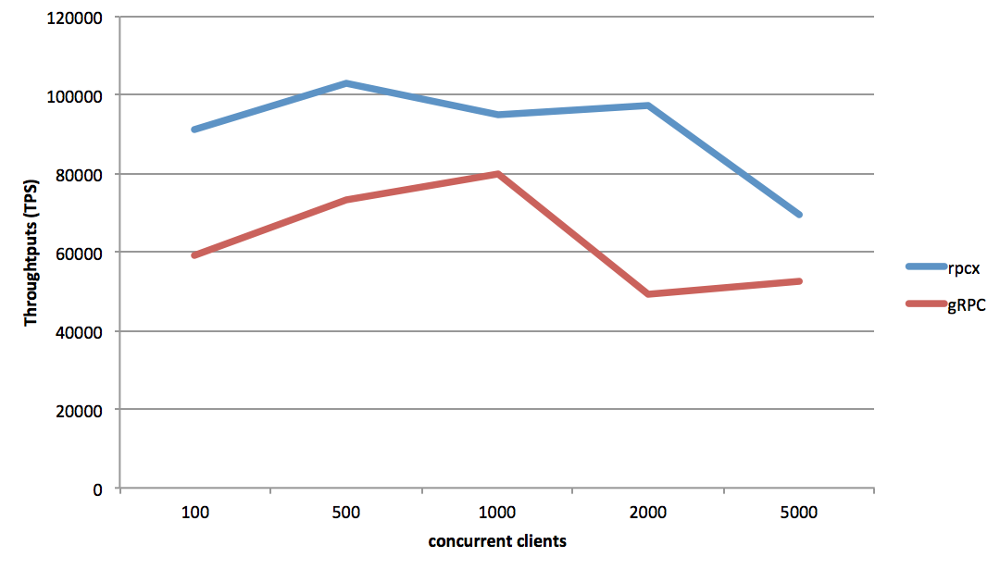
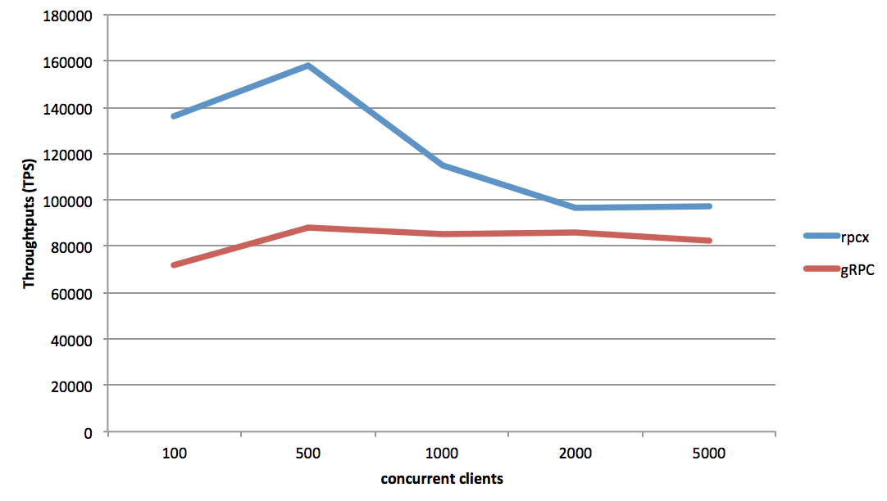

# rpcx

[**中文介绍**](README-CN.md) [**中文电子书**](https://www.gitbook.com/book/smallnest/go-rpc/details)

[](https://opensource.org/licenses/Apache-2.0) [](http://godoc.org/github.com/smallnest/rpcx)   [](https://goreportcard.com/report/github.com/smallnest/rpcx)


rpcx is a distributed RPC framework like [Alibaba Dubbo](http://dubbo.io/) and [Weibo Motan](https://github.com/weibocom/motan).
It is based on Go net/rpc and provides extra governance features.




very very good performance. Much better than gRPC, Dubbo and weibo Motan.


When we talk about RPC frameworks, Dubbo is the first framework we should mention, and also Dubbox mantained by dangdang.
Dubbo has been widely used in e-commerce companies in China, for example, Alibaba, Jingdong and Dangdang.

Though Dubbo still uses Spring 2.5.6.SEC03, and is no longer supported by Alibaba, 
some other companies still usea it and maintain their own branches.

> DUBBO is a distributed service framework , provides high performance and transparent RPC remote service call. 
> It is the core framework of Alibaba SOA service governance programs. 
> There are 3,000,000,000 calls for 2,000+ services per day, 
> and it has been widely used in various member sites of Alibaba Group.

Motan is open source now by Weibo. As Zhang Lei said, he is the current main developer of Motan:

> Motan started in 2013. There are 100 billion calls for hundreds of service calls every day.

Those two RPC frameworks are developed in Java. 
There are other famous RPC frameworks such as [thrift](https://thrift.apache.org/)、and [finagle](https://github.com/twitter/finagle)。

The goal of [rpcx](https://github.com/smallnest/rpcx) is to implement an RPC framework like Dubbo in Go.
It is developed in Go, and to be used in Go. 

It is a distributed、pluggable RPC framework with governance (service discovery、load balancer、fault tolerance、monitoring, etc.).

As you know, RPC frameworks already exists, for example, [net/rpc](https://golang.org/pkg/net/rpc/)、[grpc-go](https://github.com/grpc/grpc-go)、[gorilla-rpc](http://www.gorillatoolkit.org/pkg/rpc),
So why re-invent the wheel?

Although those Go RPC frameworks work well, their function is relatively simple and they only implement end-to-end communication.
They lack some product features of service management functions like service discovery,
load balancing, and fault tolerance. 

So I created rpcx and expect it to become an RPC framework like Dubbo.


A similar project in go is called [go-micro](https://github.com/micro/go-micro). 


## What's RPC
From wikiPedia:

> In distributed computing, a remote procedure call (RPC) is when a computer program causes a procedure (subroutine) to execute in another address space (commonly on another computer on a shared network), which is coded as if it were a normal (local) procedure call, without the programmer explicitly coding the details for the remote interaction. That is, the programmer writes essentially the same code whether the subroutine is local to the executing program, or remote.[1] This is a form of client–server interaction (caller is client, executer is server), typically implemented via a request–response message-passing system. The object-oriented programming analog is remote method invocation (RMI). The RPC model implies a level of location transparency, namely that calling procedures is largely the same whether it is local or remote, but usually they are not identical, so local calls can be distinguished from remote calls. Remote calls are usually orders of magnitude slower and less reliable than local calls, so distinguishing them is useful.
>
>RPCs are a form of inter-process communication (IPC), in that different processes have different address spaces: if on the same host machine, they have distinct virtual address spaces, even though the physical address space is the same; while if they are on different hosts, the physical address space is different. Many different (often incompatible) technologies have been used to implement the concept.


Sequence of events during an RPC
1. The client calls the client stub. The call is a local procedure call, with parameters pushed on to the stack in the normal way.
2. The client stub packs the parameters into a message and makes a system call to send the message. Packing the parameters is called marshalling.
3. The client's local operating system sends the message from the client machine to the server machine.
4. The local operating system on the server machine passes the incoming packets to the server stub.
5. The server stub unpacks the parameters from the message. Unpacking the parameters is called unmarshalling.
6. Finally, the server stub calls the server procedure. The reply traces the same steps in the reverse direction.


There are two ways to implement RPC frameworks. 
One focusses on cross-language calls and the other focusses on service governance.

Dubbo、DubboX、and Motan are RPC frameworks focusing on service governance.
Thrift、gRPC、Hessian、and Hprose are RPC frameworks focusing on cross-language calls.

rpcx focus in on service governance.

## Features

[more features](feature)


* Based on net/rpc. a Go net/prc project can be converted to use rpcx with a few changes.
* Pluggable. Features are implemented by Plugins, such as service discovery.
* Communicate with TCP long connections.
* Support GeoLocation
* Support many codec. for example, Gob、Json、MessagePack、gencode、ProtoBuf.
* Service dicovery. support ZooKeeper、Etcd.
* Fault tolerance：Failover、Failfast、Failtry.
* Load banlancer：support randomSelecter, RoundRobin, consistent hashing, etc.
* Scalable.
* Other: metrics、log、timeout.
* Authorization.

[rpcx-ui](https://github.com/smallnest/rpcx-ui) provides a web ui for services management.


## Architecture
rpcx contains three roles : RPC Server，RPC Client and Registry.
* Server registers services on the Registry
* Client queries the service list and select a server from the server list returned from the Registry.
* When a Server is down, the Registry can remove the server from the list, and subsequently the client can remove it too.


So far rpcx supports ZooKeeper and Etcd as Registry，Consul support is in developement.

## Examples

There is a client calling the Posts service at tr.colobu.com. This service returns a hot tech post list of the day:
```go 
package main

import (
	"encoding/json"
	"fmt"
	"time"

	"gopkg.in/mgo.v2/bson"

	"github.com/smallnest/rpcx"
)

type Args struct {
	PostType string `msg:"posttype"`
}

type Reply struct {
	Posts []Post `msg:"posts"`
}

type Post struct {
	PostID      bson.ObjectId `json:"id" xml:"id" bson:"_id,omitempty"`
	PostType    string        `json:"ptype" xml:"ptype" bson:"ptype,omitempty"`
	Title       string        `json:"title" xml:"title" bson:"title"`
	URL         string        `json:"url" xml:"url" bson:"url"`
	Domain      string        `json:"domain" xml:"domain" bson:"domain"`
	ShortURL    string        `json:"surl" xml:"surl" bson:"surl"`
	Description string        `json:"desc" xml:"desc" bson:"desc"`
	LikeCount   int           `json:"like" xml:"like" bson:"like"`
	ImageURL    string        `json:"imgurl" xml:"imgurl" bson:"imgurl"`
	RecommendBy string        `json:"-" xml:"-" bson:"-"`
	Tags        string        `json:"tags" xml:"tags" bson:"tags"`
	State       int           `json:"-" xml:"-" bson:"-"`
	Timestamp   time.Time     `json:"ts" xml:"timestamp" bson:"ts"`
}

func main() {
	s := &rpcx.DirectClientSelector{Network: "tcp", Address: "tr.colobu.com:8972", DialTimeout: 10 * time.Second}
	client := rpcx.NewClient(s)
	defer client.Close()

	args := &Args{"golang"}
	var reply Reply
	err := client.Call("Posts.Query", args, &reply)
	if err != nil {
		fmt.Printf("error for Posts: %s, %v \n", args.PostType, err)
		return
	}

	posts := reply.Posts
	data, _ := json.MarshalIndent(&posts, "", "\t")

	fmt.Printf("Posts: %s \n", string(data))
}
```

you can found more examples at [_examples](_examples)


## Benchmark

**Test Environment**
* CPU:    Intel(R) Xeon(R) CPU E5-2620 v2 @ 2.10GHz, 24 cores
* Memory: 16G
* OS:     Linux Server-3 2.6.32-358.el6.x86_64, CentOS 6.4
* Go:     1.7

Test request is copied from protobuf project and encoded to a proto message. Its size is 581 bytes.
The response update two fields of decoded requests so the server goes through decoding and encoding.

The test proto file is:

```proto
syntax = "proto2";

package main;

option optimize_for = SPEED;


message BenchmarkMessage {
  required string field1 = 1;
  optional string field9 = 9;
  optional string field18 = 18;
  optional bool field80 = 80 [default=false];
  optional bool field81 = 81 [default=true];
  required int32 field2 = 2;
  required int32 field3 = 3;
  optional int32 field280 = 280;
  optional int32 field6 = 6 [default=0];
  optional int64 field22 = 22;
  optional string field4 = 4;
  repeated fixed64 field5 = 5;
  optional bool field59 = 59 [default=false];
  optional string field7 = 7;
  optional int32 field16 = 16;
  optional int32 field130 = 130 [default=0];
  optional bool field12 = 12 [default=true];
  optional bool field17 = 17 [default=true];
  optional bool field13 = 13 [default=true];
  optional bool field14 = 14 [default=true];
  optional int32 field104 = 104 [default=0];
  optional int32 field100 = 100 [default=0];
  optional int32 field101 = 101 [default=0];
  optional string field102 = 102;
  optional string field103 = 103;
  optional int32 field29 = 29 [default=0];
  optional bool field30 = 30 [default=false];
  optional int32 field60 = 60 [default=-1];
  optional int32 field271 = 271 [default=-1];
  optional int32 field272 = 272 [default=-1];
  optional int32 field150 = 150;
  optional int32 field23 = 23 [default=0];
  optional bool field24 = 24 [default=false];
  optional int32 field25 = 25 [default=0];
  optional bool field78 = 78;
  optional int32 field67 = 67 [default=0];
  optional int32 field68 = 68;
  optional int32 field128 = 128 [default=0];
  optional string field129 = 129 [default="xxxxxxxxxxxxxxxxxxxxx"];
  optional int32 field131 = 131 [default=0];
}
```


The test is run with 100, 1000, 2000 and 5000 concurrent clients. The total number of requests per clients is 1,000,000.

**Test Result**

### rpcx: one client and one server on the same machine
concurrent clients|mean(ms)|median(ms)|max(ms)|min(ms)|throughput(TPS)
-------------|-------------|-------------|-------------|-------------|-------------
100|0|0|17|0|164338
500|2|1|40|0|181126
1000|4|3|56|0|186219
2000|9|7|105|0|182815
5000|25|22|200|0|178858


you can use test code in `_benchmark` to test.
`server` is used to start a server and `client` is used as clients via protobuf.

The above test is with a client and a server running on the same mechine.

### rpcx: one client and one server running on different machines

If I run them on separate servers, the test results are:

concurrent clients|mean(ms)|median(ms)|max(ms)|min(ms)|throughput(TPS)
-------------|-------------|-------------|-------------|-------------|-------------
100|1|1|20|0|127975
500|5|1|4350|0|136407
1000|10|2|3233|0|155255
2000|17|2|9735|0|159438
5000|44|2|12788|0|161917 

### rpcx: one client on one machine and two servers on two machines

When running in cluster mode, with one machine with one client and another two running as servers, the test results are:

concurrent clients|mean(ms)|median(ms)|max(ms)|min(ms)|throughput(TPS)
-------------|-------------|-------------|-------------|-------------|-------------
100|0|0|41|0|128932
500|3|2|273|0|150285
1000|5|5|621|0|150152
2000|10|7|288|0|159974
5000|23|12|629|0|155279


### benchmarks of serialization libraries:

```
[root@localhost rpcx]# go test -bench . -test.benchmem
PASS
BenchmarkNetRPC_gob-16            100000             18742 ns/op             321 B/op          9 allocs/op
BenchmarkNetRPC_jsonrpc-16        100000             21360 ns/op            1170 B/op         31 allocs/op
BenchmarkNetRPC_msgp-16           100000             18617 ns/op             776 B/op         35 allocs/op
BenchmarkRPCX_gob-16              100000             18718 ns/op             320 B/op          9 allocs/op
BenchmarkRPCX_json-16             100000             21238 ns/op            1170 B/op         31 allocs/op
BenchmarkRPCX_msgp-16             100000             18635 ns/op             776 B/op         35 allocs/op
BenchmarkRPCX_gencodec-16         100000             18454 ns/op            4485 B/op         17 allocs/op
BenchmarkRPCX_protobuf-16         100000             17234 ns/op             733 B/op         13 allocs/op
```

## Comparision with gRPC
[gRPC](https://github.com/grpc/grpc-go) is the RPC framework by Google. It supports multiple programming lanaguage.
I have compared three cases for prcx and gRPC. It shows rpcx is much better than gRPC.

current gRPC version is 1.0.

The test results for rpcx can be found above. Below is the test results for gRPC.

### gRPC: one client and one server on the same machine
concurrent clients|mean(ms)|median(ms)|max(ms)|min(ms)|throughput(TPS)
-------------|-------------|-------------|-------------|-------------|-------------
100|1|0|21|0|68250
500|5|1|3059|0|78486
1000|10|1|6274|0|79980
2000|19|1|9736|0|58129
5000|43|2|14224|0|44724




### gRPC: one client and one server running on different machines
concurrent clients|mean(ms)|median(ms)|max(ms)|min(ms)|throughput(TPS)
-------------|-------------|-------------|-------------|-------------|-------------
100|1|0|21|0|68250
500|5|1|3059|0|78486
1000|10|1|6274|0|79980
2000|19|1|9736|0|58129
5000|43|2|14224|0|44724 




### gRPC: one client on one machine and two servers on two machines
concurrent clients|mean(ms)|median(ms)|max(ms)|min(ms)|throughput(TPS)
-------------|-------------|-------------|-------------|-------------|-------------
100|1|0|19|0|88082
500|4|1|1461|0|90334
1000|9|1|6315|0|62305
2000|17|1|9736|0|44487
5000|38|1|25087|0|33198



